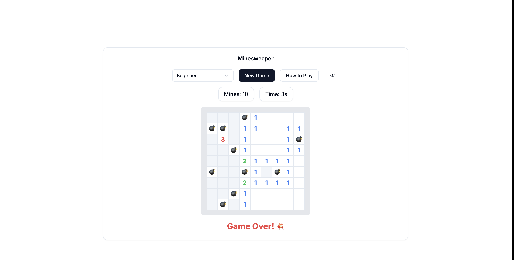

# 🎮 Modern Minesweeper

A modern implementation of the classic Minesweeper game built with Next.js, TypeScript, and TailwindCSS. Features a clean UI, dark mode support, and sound effects.



## ✨ Features

- 🎯 Three difficulty levels: Beginner, Intermediate, and Expert
- 🔊 Sound effects for actions (can be muted)
- 🎨 Modern UI with smooth animations
- 📱 Responsive design
- ⌨️ Keyboard accessibility
- 💡 Built-in "How to Play" guide

## 🚀 Getting Started

### Prerequisites

- Node.js 18+
- npm or yarn

### Installation

```bash
# Clone the repository
git clone https://github.com/yourusername/minesweeper.git

# Navigate to project directory
cd minesweeper

# Install dependencies
npm install

# Start development server
npm run dev
```

Visit `http://localhost:3000` to play the game.

## 🎮 How to Play

1. Left-click to reveal a cell
2. Right-click to place/remove a flag
3. Numbers show how many mines are in adjacent cells
4. Flag all mines to win
5. Don't click on a mine or game over!

## 🛠️ Built With

- [Next.js 14](https://nextjs.org/) - React Framework
- [TypeScript](https://www.typescriptlang.org/) - Type Safety
- [TailwindCSS](https://tailwindcss.com/) - Styling
- [Shadcn/ui](https://ui.shadcn.com/) - UI Components
- [Radix UI](https://www.radix-ui.com/) - Accessible Components
- [Lucide Icons](https://lucide.dev/) - Icons

## 📝 License

This project is licensed under the MIT License - see the [LICENSE](LICENSE) file for details.

## 🤝 Contributing

Contributions are welcome! Please feel free to submit a Pull Request.

1. Fork the project
2. Create your feature branch (`git checkout -b feature/AmazingFeature`)
3. Commit your changes (`git commit -m 'Add some AmazingFeature'`)
4. Push to the branch (`git push origin feature/AmazingFeature`)
5. Open a Pull Request

## 🎯 Game Features

### Difficulty Levels

- 🌱 Beginner: 9x9 grid with 10 mines
- ⭐ Intermediate: 16x16 grid with 40 mines
- 🔥 Expert: 16x30 grid with 99 mines

### Controls

- Left Click: Reveal cell
- Right Click: Place/remove flag
- Double Click: Quick reveal (on revealed numbers)

### UI Features

- Real-time mine counter
- Timer
- Theme toggle (Dark/Light mode)
- Sound toggle
- Responsive design for all screen sizes
